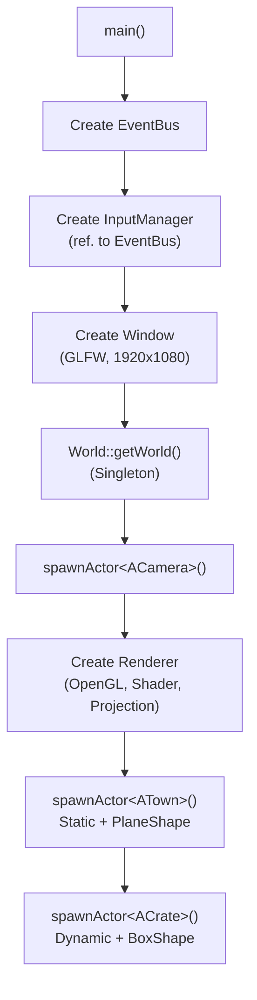
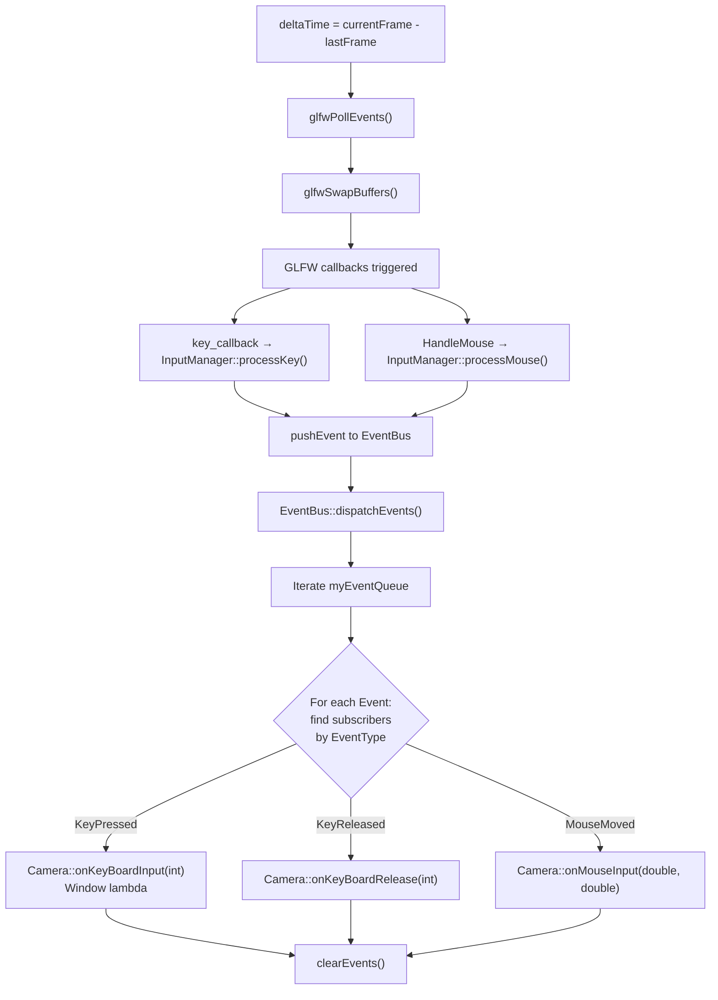
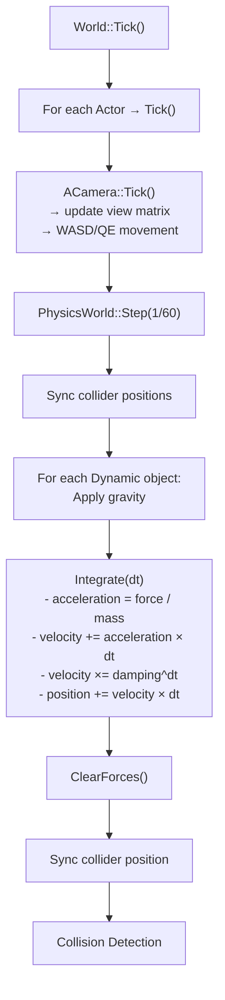
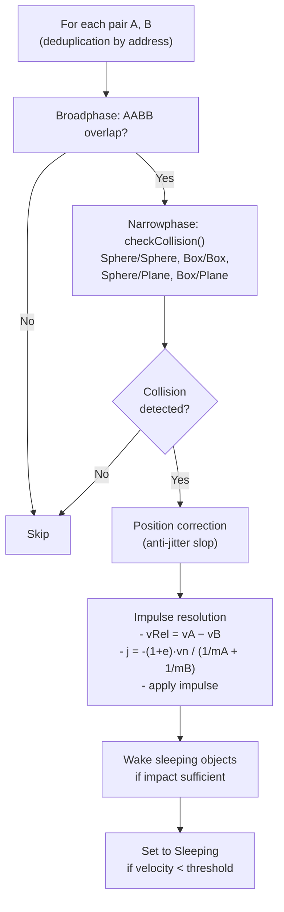
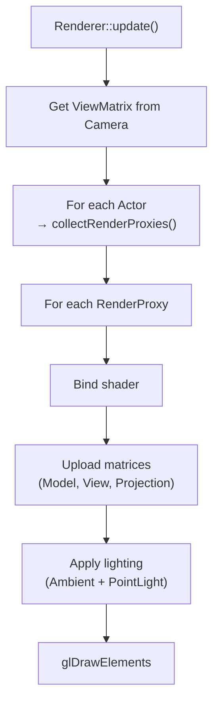
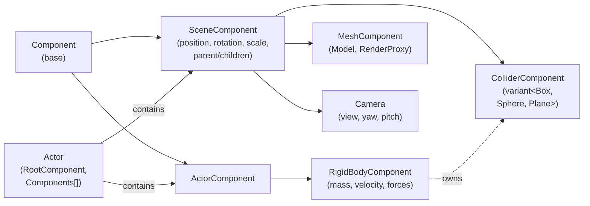
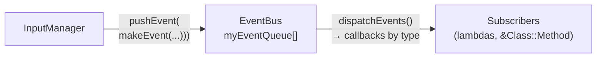

# OPENGL_Engine

Real-time 3D graphics engine in **C++20** with **OpenGL**, integrating a scene graph inspired by Unreal Engine, a decoupled event system (Event Bus), and a rigid-body physics engine.

---

## Table of Contents

- [Dependencies](#dependencies)
- [Build](#build)
- [File Architecture](#file-architecture)
- [Game Loop](#game-loop)
- [Scene Graph (Unreal-inspired ECS)](#scene-graph)
- [Event Bus](#event-bus)
- [Physics Engine](#physics-engine)
- [Rendering](#rendering)
- [Input](#input)
- [Architecture Diagrams](#architecture-diagrams)
- [TODO / Roadmap](#todo--roadmap)

---

## Dependencies

| Library | Role | Management |
|---|---|---|
| **OpenGL** | Graphics API | System |
| **GLFW 3** | Windowing, GL context, inputs | vcpkg |
| **GLAD** | OpenGL function loading | vcpkg |
| **GLM** | Mathematics (vectors, matrices) | vcpkg |
| **Assimp** | 3D model import (FBX, OBJ…) | vcpkg |
| **stb_image** | Texture loading (PNG, JPG…) | Header-only included |

---

## Build

```bash
# Requirements: CMake >= 3.21, vcpkg with packages above
cmake -B out/build -S . -DCMAKE_TOOLCHAIN_FILE=[vcpkg-root]/scripts/buildsystems/vcpkg.cmake
cmake --build out/build --config Release
```

Or open the folder directly in **Visual Studio** (native CMake).

---

## File Architecture

```
OPENGL_Engine/
├── main.cpp                       # Entry point, game loop
├── CMakeLists.txt                 # CMake configuration (C++20)
├── headers/                       # Global headers
│   ├── eventBus.h                 #   Publish/Subscribe system
│   ├── inputManager.h             #   Keyboard/mouse input handling
│   ├── window.h                   #   GLFW window
│   └── utilities.h                #   Logs, globals (deltaTime)
├── src/                           # Global implementations
│   ├── eventBus.cpp
│   ├── inputManager.cpp
│   └── window.cpp
├── sceneGraph/                    # Scene Graph & ECS
│   ├── headers/
│   │   ├── world.h                #   Singleton World (actors + physics)
│   │   ├── actor.h                #   Base entity (Actor)
│   │   ├── component.h            #   Component, SceneComponent, MeshComponent
│   │   └── camera.h               #   Camera + ACamera
│   └── src/
│       ├── world.cpp
│       ├── actor.cpp
│       ├── component.cpp
│       └── camera.cpp
├── render/                        # OpenGL rendering pipeline
│   ├── headers/
│   │   ├── renderer.h             #   Rendering orchestrator
│   │   ├── shader.h               #   Vertex/fragment shader compilation
│   │   ├── model.h                #   Model loading (Assimp)
│   │   ├── mesh.h                 #   VAO/VBO/IBO, vertices, draw calls
│   │   ├── texture.h              #   OpenGL textures
│   │   └── light.h                #   Lighting (Ambient + PointLight)
│   └── src/
├── physics/                       # Rigid-body physics engine
│   ├── headers/
│   │   ├── physicsWorld.h         #   Simulation (Step, detection, resolution)
│   │   └── physicsComponent.h     #   RigidBody, Collider, geometric shapes
│   └── src/
│       ├── physicsWorld.cpp
│       └── physicsComponent.cpp
└── Assets/                        # 3D models (FBX)
```

---

## Game Loop

Defined in `main.cpp`, the loop follows the classic **Input → Events → Logic/Physics → Render** pattern:

```
while (!window->shouldClose())
│
├─ 1. window->update()              // glfwPollEvents → GLFW callbacks
│     └─ InputManager pushes events to EventBus
│
├─ 2. eventBus->dispatchEvents()    // Distributes events to subscribers
│     └─ Calls callbacks (Camera, Window…) then clears queue
│
├─ 3. world.Tick()
│     ├─ Actor::Tick() for each actor (ex: Camera updates view)
│     └─ PhysicsWorld::Step(1/60)
│         ├─ Gravity + Integration
│         ├─ Collision detection (Broadphase AABB + Narrowphase)
│         └─ Resolution (position correction + impulse)
│
└─ 4. renderer->update()            // Collects RenderProxies → OpenGL draw
```

---

## Scene Graph

Hierarchy of components attached to **Actors**, inspired by Unreal Engine:

```
Actor
├── RootComponent (SceneComponent)     ← Root of transformation graph
│   ├── MeshComponent                  ← 3D model (child)
│   └── other SceneComponents...
└── ActorComponents[]                  ← Logic components without transform
    └── RigidBodyComponent             ← Physics (mass, velocity, forces)
        └── ColliderComponent (owned)
```

| Class | Inherits from | Role |
|---|---|---|
| `Component` | — | Base: owner, active, valid |
| `ActorComponent` | `Component` | Logic components without transformation |
| `SceneComponent` | `ActorComponent` | Position, rotation, scale + parent/children tree |
| `MeshComponent` | `SceneComponent` | Contains a `Model`, provides `RenderProxy` |
| `Camera` | `SceneComponent` | FPS view (yaw/pitch), view matrix |
| `RigidBodyComponent` | `ActorComponent` | Mass, velocity, forces, body type |
| `ColliderComponent` | `SceneComponent` | Geometric shape (`variant<Box, Sphere, Plane>`) |

**Tick** is recursive: `Actor::Tick()` → `RootComponent::Tick()` → propagates to children, then ticks `ActorComponent` not in the graph.

---

## Event Bus

Decoupled **Publish/Subscribe** system (`eventBus.h` / `eventBus.cpp`).

### How It Works

1. **Producers** (ex: `InputManager`) push events to queue via `pushEvent(makeEvent(type, name, args...))`
2. **Each frame**, `dispatchEvents()` iterates queue, calls callbacks registered by `EventType`, then clears queue
3. **Subscribers** register via `subscribe()`

### Available Events (bitmask)

| EventType | Payload | Consumers |
|---|---|---|
| `KeyPressed` | `int` (key code) | Camera, Window |
| `KeyReleased` | `int` | Camera, Window |
| `MouseMoved` | `double, double` (x, y) | Camera, Window |
| `WindowResized` | `int, int` (w, h) | — |

### `subscribe` Overloads

```cpp
// Lambda / std::function
eventBus->subscribe(type, [](const Event& e) { ... });

// Member method + raw pointer (auto-unpacks payload)
eventBus->subscribe(EventType::KeyPressed, &Camera::onKeyBoardInput, this);

// Member method + shared_ptr (safe via internal weak_ptr)
eventBus->subscribe(type, &MyClass::onEvent, sharedInstance);
```

Template overloads use `dynamic_cast<const PayloadEvent<Args...>*>` + `std::apply` to call member method directly with unpacked arguments.

---

## Physics Engine

Fixed-step rigid-body simulation (1/60 s), in `physicsWorld.cpp` / `physicsComponent.cpp`.

### Body Types (`bodyType`)

| Type | Behavior |
|---|---|
| `Static` | Immobile, inverse mass = 0 |
| `Dynamic` | Subject to gravity and collisions |
| `Sleeping` | Dynamic at rest (velocity < threshold), woken by collision |

### Collision Shapes (`std::variant<BoxShape, SphereShape, PlaneShape>`)

| Shape | Data |
|---|---|
| `SphereShape` | `float radius` |
| `BoxShape` | `vec3 halfExtents` |
| `PlaneShape` | `vec3 normal, float offset` |

### Integration (`RigidBodyComponent::Integrate`)

Semi-implicit Euler:

```
acceleration  = resultantForce × inverseMass
velocity     += acceleration × dt
velocity     *= damping^dt                       // air friction (0.99)
position     += velocity × dt
```

### Collision Pipeline

```
Broadphase (AABB overlap)
    │ no → skip
    ▼ yes
Narrowphase (precise geometric test)
    ├─ Sphere vs Sphere : distance between centers < sum of radii
    ├─ Box vs Box       : simplified SAT (3 axes, least penetration)
    ├─ Sphere vs Plane  : signed distance < radius
    └─ Box vs Plane     : project half-extents on normal
    ▼
Position correction (with anti-jitter slop 0.01)
    ▼
Impulse resolution:
    j = -(1 + restitution) × dot(vRel, n) / (1/mA + 1/mB)
    vA += j × n / mA
    vB -= j × n / mB
```

---

## Rendering

Forward OpenGL pipeline defined in `renderer.cpp`:

1. **Loading**: `Model::Load()` via Assimp → node tree → `Mesh` (VAO/VBO/IBO) + textures
2. **Collection**: `Actor::collectRenderProxies()` traverses scene graph; each `MeshComponent` provides `RenderProxy` (world matrix + model)
3. **Draw**: for each proxy → bind shader, upload matrices (Model, View, Projection), lighting (Ambient + PointLight), `glDrawElements`

---

## Input

```
GLFW callbacks (static)
    ├─ key_callback   → InputManager::processKey(key, action)
    └─ HandleMouse    → InputManager::processMouse(xPos, yPos)
                              │
                   pushEvent(makeEvent(...)) → EventBus
```

`InputManager` transforms raw GLFW callbacks into typed events (`KeyPressedEvent`, `MouseEvent`) and pushes them to `EventBus`.

---

## Architecture Diagrams

### Diagram 1: Initialization



### Diagram 2: Game Loop - Input & Events



### Diagram 3: Game Loop - Ticking & Physics



### Diagram 4: Game Loop - Collision & Resolution



### Diagram 5: Game Loop - Rendering



### Diagram 6: Component Architecture



### Diagram 7: Event Bus System



---

## TODO / Roadmap

- [ ] **Angular Physics** — Torques, inertia tensor, angular velocity
- [ ] **Multi-contact** — `CollisionManyFold` prepared for multiple contact points, only one generated currently
- [ ] **Spatial Partitioning** — Detection is O(n²); add grid or BVH
- [ ] **Sphere vs Box** — Collider combination not yet implemented
- [ ] **Tangential Friction** — No friction in impulse resolution
- [ ] **EventBus Unsubscribe** — No `unsubscribe` mechanism
- [ ] **Advanced Lighting** — Specular, multiple lights, shadow mapping
- [ ] **Center of Mass** — `calculateCenterOfMassFromMesh` always returns `(0,0,0)`