# OPENGL_Engine

Moteur graphique 3D temps réel en **C++20** avec **OpenGL**, intégrant un scene graph inspiré d'Unreal Engine, un système d'événements découplé (Event Bus) et un moteur physique rigid-body.

---

## Table des matières

- [Dépendances](#dépendances)
- [Build](#build)
- [Architecture des fichiers](#architecture-des-fichiers)
- [Boucle de jeu](#boucle-de-jeu)
- [Scene Graph (ECS inspiré Unreal)](#scene-graph)
- [Event Bus](#event-bus)
- [Moteur physique](#moteur-physique)
- [Rendu](#rendu)
- [Input](#input)
- [Diagramme global](#diagramme-global)
- [TODO / Roadmap](#todo--roadmap)

---

## Dépendances

| Bibliothèque | Rôle | Gestion |
|---|---|---|
| **OpenGL** | API graphique | Système |
| **GLFW 3** | Fenêtrage, contexte GL, inputs | vcpkg |
| **GLAD** | Chargement des fonctions OpenGL | vcpkg |
| **GLM** | Mathématiques (vecteurs, matrices) | vcpkg |
| **Assimp** | Import de modèles 3D (FBX, OBJ…) | vcpkg |
| **stb_image** | Chargement de textures (PNG, JPG…) | Header-only inclus |

---

## Build

```bash
# Prérequis : CMake >= 3.21, vcpkg avec les paquets ci-dessus
cmake -B out/build -S . -DCMAKE_TOOLCHAIN_FILE=[vcpkg-root]/scripts/buildsystems/vcpkg.cmake
cmake --build out/build --config Release
```

Ou ouvrir directement le dossier dans **Visual Studio** (CMake natif).

---

## Architecture des fichiers

```
OPENGL_Engine/
├── main.cpp                       # Point d'entrée, boucle de jeu
├── CMakeLists.txt                 # Configuration CMake (C++20)
├── headers/                       # En-têtes globaux
│   ├── eventBus.h                 #   Système Publish/Subscribe
│   ├── inputManager.h             #   Gestion des inputs clavier/souris
│   ├── window.h                   #   Fenêtre GLFW
│   └── utilities.h                #   Logs, globals (deltaTime)
├── src/                           # Implémentations globales
│   ├── eventBus.cpp
│   ├── inputManager.cpp
│   └── window.cpp
├── sceneGraph/                    # Scene Graph & ECS
│   ├── headers/
│   │   ├── world.h                #   Singleton World (acteurs + physique)
│   │   ├── actor.h                #   Entité de base (Actor)
│   │   ├── component.h            #   Component, SceneComponent, MeshComponent
│   │   └── camera.h               #   Camera + ACamera
│   └── src/
│       ├── world.cpp
│       ├── actor.cpp
│       ├── component.cpp
│       └── camera.cpp
├── render/                        # Pipeline de rendu OpenGL
│   ├── headers/
│   │   ├── renderer.h             #   Orchestrateur du rendu
│   │   ├── shader.h               #   Compilation vertex/fragment shaders
│   │   ├── model.h                #   Chargement de modèles (Assimp)
│   │   ├── mesh.h                 #   VAO/VBO/IBO, vertices, draw calls
│   │   ├── texture.h              #   Textures OpenGL
│   │   └── light.h                #   Éclairage (Ambient + PointLight)
│   └── src/
├── physics/                       # Moteur physique rigid-body
│   ├── headers/
│   │   ├── physicsWorld.h         #   Simulation (Step, détection, résolution)
│   │   └── physicsComponent.h     #   RigidBody, Collider, formes géométriques
│   └── src/
│       ├── physicsWorld.cpp
│       └── physicsComponent.cpp
└── Assets/                        # Modèles 3D (FBX)
```

---

## Boucle de jeu

Définie dans `main.cpp`, la boucle suit le schéma classique **Input → Événements → Logique/Physique → Rendu** :

```
while (!window->shouldClose())
│
├─ 1. window->update()              // glfwPollEvents → callbacks GLFW
│     └─ InputManager pousse les événements dans l'EventBus
│
├─ 2. eventBus->dispatchEvents()    // Distribue les événements aux abonnés
│     └─ Appelle les callbacks (Camera, Window…) puis vide la file
│
├─ 3. world.Tick()
│     ├─ Actor::Tick() pour chaque acteur (ex: Camera met à jour la vue)
│     └─ PhysicsWorld::Step(1/60)
│         ├─ Gravité + Intégration
│         ├─ Détection de collision (Broadphase AABB + Narrowphase)
│         └─ Résolution (correction de position + impulsion)
│
└─ 4. renderer->update()            // Collecte les RenderProxies → OpenGL draw
```

---

## Scene Graph

Hiérarchie de composants attachés à des **Actors**, inspirée d'Unreal Engine :

```
Actor
├── RootComponent (SceneComponent)     ← Racine du graphe de transformation
│   ├── MeshComponent                  ← Modèle 3D (enfant)
│   └── autres SceneComponents...
└── ActorComponents[]                  ← Composants logiques sans transform
    └── RigidBodyComponent             ← Physique (masse, vitesse, forces)
        └── ColliderComponent (possédé)
```

| Classe | Hérite de | Rôle |
|---|---|---|
| `Component` | — | Base : owner, active, valid |
| `ActorComponent` | `Component` | Composants logiques sans transformation |
| `SceneComponent` | `ActorComponent` | Position, rotation, scale + arbre parent/enfants |
| `MeshComponent` | `SceneComponent` | Contient un `Model`, fournit un `RenderProxy` |
| `Camera` | `SceneComponent` | Vue FPS (yaw/pitch), matrice de vue |
| `RigidBodyComponent` | `ActorComponent` | Masse, vitesse, forces, type de corps |
| `ColliderComponent` | `SceneComponent` | Forme géométrique (`variant<Box, Sphere, Plane>`) |

Le **Tick** est récursif : `Actor::Tick()` → `RootComponent::Tick()` → propage aux enfants, puis tick les `ActorComponent` non présents dans le graphe.

---

## Event Bus

Système **Publish/Subscribe** découplé (`eventBus.h` / `eventBus.cpp`).

### Fonctionnement

1. **Producteurs** (ex: `InputManager`) poussent des événements dans la file via `pushEvent(makeEvent(type, name, args...))`
2. **Chaque frame**, `dispatchEvents()` itère sur la file, appelle les callbacks enregistrés par `EventType`, puis vide la file
3. **Abonnés** s'enregistrent via `subscribe()`

### Événements disponibles (bitmask)

| EventType | Payload | Consommateurs |
|---|---|---|
| `KeyPressed` | `int` (code touche) | Camera, Window |
| `KeyReleased` | `int` | Camera, Window |
| `MouseMoved` | `double, double` (x, y) | Camera, Window |
| `WindowResized` | `int, int` (w, h) | — |

### Surcharges de `subscribe`

```cpp
// Lambda / std::function
eventBus->subscribe(type, [](const Event& e) { ... });

// Méthode membre + raw pointer (dépaquetage automatique du payload)
eventBus->subscribe(EventType::KeyPressed, &Camera::onKeyBoardInput, this);

// Méthode membre + shared_ptr (sécurisé via weak_ptr interne)
eventBus->subscribe(type, &MyClass::onEvent, sharedInstance);
```

Les surcharges template utilisent `dynamic_cast<const PayloadEvent<Args...>*>` + `std::apply` pour appeler directement la méthode membre avec les arguments dépaquetés.

---

## Moteur physique

Simulation rigid-body à pas fixe (1/60 s), dans `physicsWorld.cpp` / `physicsComponent.cpp`.

### Types de corps (`bodyType`)

| Type | Comportement |
|---|---|
| `Static` | Immobile, masse inverse = 0 |
| `Dynamic` | Soumis à la gravité et aux collisions |
| `Sleeping` | Dynamique au repos (vitesse < seuil), réveillé par collision |

### Formes de collision (`std::variant<BoxShape, SphereShape, PlaneShape>`)

| Forme | Données |
|---|---|
| `SphereShape` | `float radius` |
| `BoxShape` | `vec3 halfExtents` |
| `PlaneShape` | `vec3 normal, float offset` |

### Intégration (`RigidBodyComponent::Integrate`)

Euler semi-implicite :

```
accélération  = forceRésultante × masseInverse
vitesse      += accélération × dt
vitesse      *= damping^dt                       // friction aérodynamique (0.99)
position     += vitesse × dt
```

### Pipeline de collision

```
Broadphase (AABB overlap)
    │ non → skip
    ▼ oui
Narrowphase (test géométrique précis)
    ├─ Sphere vs Sphere : distance entre centres < somme des rayons
    ├─ Box vs Box       : SAT simplifié (3 axes, moindre pénétration)
    ├─ Sphere vs Plane  : distance signée < rayon
    └─ Box vs Plane     : projection des demi-extensions sur la normale
    ▼
Correction de position (avec slop anti-jitter de 0.01)
    ▼
Résolution d'impulsion :
    j = -(1 + restitution) × dot(vRel, n) / (1/mA + 1/mB)
    vA += j × n / mA
    vB -= j × n / mB
```

---

## Rendu

Pipeline OpenGL forward défini dans `renderer.cpp` :

1. **Chargement** : `Model::Load()` via Assimp → arbre de nœuds → `Mesh` (VAO/VBO/IBO) + textures
2. **Collecte** : `Actor::collectRenderProxies()` parcourt le scene graph ; chaque `MeshComponent` fournit un `RenderProxy` (matrice monde + modèle)
3. **Draw** : pour chaque proxy → bind shader, upload matrices (Model, View, Projection), éclairage (Ambient + PointLight), `glDrawElements`

---

## Input

```
GLFW callbacks (statiques)
    ├─ key_callback   → InputManager::processKey(key, action)
    └─ HandleMouse    → InputManager::processMouse(xPos, yPos)
                              │
                   pushEvent(makeEvent(...)) → EventBus
```

`InputManager` transforme les callbacks GLFW bruts en événements typés (`KeyPressedEvent`, `MouseEvent`) et les pousse dans l'`EventBus`.

---

## Diagramme global

```mermaid
flowchart TD
    subgraph INIT["🚀 Initialization (main.cpp)"]
        M1["main()"] --> M2["Create EventBus"]
        M2 --> M3["Create InputManager\n(ref. to EventBus)"]
        M3 --> M4["Create Window\n(GLFW, 1920x1080)"]
        M4 --> M5["World::getWorld()\n(Singleton)"]
        M5 --> M6["spawnActor&lt;ACamera&gt;()"]
        M6 --> M7["Create Renderer\n(OpenGL, Shader, Projection)"]
        M7 --> M8["spawnActor&lt;ATown&gt;()\nStatic + PlaneShape"]
        M8 --> M9["spawnActor&lt;ACrate&gt;()\nDynamic + BoxShape"]
    end

    subgraph LOOP["🔄 Game loop (each frame)"]
        direction TB
        L0["deltaTime = currentFrame - lastFrame"]
        L0 --> L1

        subgraph L1["1. Window::update()"]
            W1["glfwPollEvents()"] --> W2["glfwSwapBuffers()"]
            W2 --> W3["GLFW callbacks triggered"]
            W3 --> W4["key_callback → InputManager::processKey()"]
            W3 --> W5["HandleMouse → InputManager::processMouse()"]
        end

        L1 --> L2

        subgraph L2["2. EventBus::dispatchEvents()"]
            E1["Iterate over myEventQueue"] --> E2{"For each Event:\nfind subscribers\nby EventType"}
            E2 -->|"KeyPressed"| E3["Camera::onKeyBoardInput(int)\nWindow lambda (Esc, ←, →)"]
            E2 -->|"KeyReleased"| E4["Camera::onKeyBoardRelease(int)\nWindow lambda"]
            E2 -->|"MouseMoved"| E5["Camera::onMouseInput(double, double)\nWindow lambda"]
            E3 --> E6["clearEvents()"]
            E4 --> E6
            E5 --> E6
        end

        L2 --> L3

        subgraph L3["3. World::Tick()"]
            T1["For each Actor → Tick()"] --> T1b["ACamera::Tick()\n→ Camera::update()\n→ WASD/QE movement\n→ CalculateViewMatrix()"]
            T1b --> T2

            subgraph T2["PhysicsWorld::Step(1/60)"]
                direction TB
                P0["Sync collider positions\n(all objects)"]
                P0 --> P1

                subgraph P1["For each Dynamic object"]
                    PH1["Apply gravity\n(force += g × mass)"]
                    PH1 --> PH2["Integrate(dt)\n─ acceleration = force / mass\n─ velocity += acceleration × dt\n─ velocity ×= damping^dt\n─ position += velocity × dt"]
                    PH2 --> PH3["ClearForces()"]
                    PH3 --> PH4["Sync collider position"]
                end

                P1 --> P2

                subgraph P2["Collision detection & resolution"]
                    direction TB
                    C1["For each pair (A, B)\ndeduplication by address"]
                    C1 --> C2["Broadphase: AABB overlap?"]
                    C2 -->|"No"| C2b["Skip"]
                    C2 -->|"Yes"| C3["Narrowphase: checkCollision()\nSphere/Sphere, Box/Box,\nSphere/Plane, Box/Plane"]
                    C3 --> C4{"Collision?"}
                    C4 -->|"No"| C2b
                    C4 -->|"Yes"| C5["Position correction\n(with anti-jitter slop)"]
                    C5 --> C6["Impulse resolution\n─ vRel = vA − vB\n─ j = -(1+e)·vn / (1/mA + 1/mB)\n─ apply impulse"]
                    C6 --> C7["Wake sleeping objects\nif impact is sufficient"]
                end

                P2 --> P3["Set to Sleeping\nif velocity < threshold"]
            end
        end

        L3 --> L4

        subgraph L4["4. Renderer::update()"]
            R1["Get ViewMatrix\nfrom Camera"] --> R2["For each Actor\n→ collectRenderProxies()"]
            R2 --> R3["For each RenderProxy\n→ glDraw with\nModel, Projection, View"]
            R3 --> R4["Apply lighting\n(Ambient + PointLight)"]
        end
    end

    INIT --> LOOP

    subgraph ARCH["📐 Component architecture (Unreal-inspired ECS)"]
        direction LR
        CO["Component\n(base)"] --> AC["ActorComponent"]
        CO --> SC["SceneComponent\n(position, rotation, scale,\nparent/children)"]
        AC --> RB["RigidBodyComponent\n(mass, velocity, forces,\nbodyType)"]
        SC --> MC["MeshComponent\n(Model, RenderProxy)"]
        SC --> CAM["Camera\n(view, yaw, pitch)"]
        SC --> COL["ColliderComponent\n(ShapeData = variant<\nBoxShape, SphereShape,\nPlaneShape>)"]
        RB -.->|"owns"| COL
        ACT["Actor\n(RootComponent,\nComponents[])"] -->|"contains"| SC
        ACT -->|"contains"| AC
    end

    subgraph EVBUS["📨 Event Bus (Publish / Subscribe)"]
        direction LR
        IM["InputManager"] -->|"pushEvent(\nmakeEvent(type, args...))"| EB["EventBus\nmyEventQueue[]"]
        EB -->|"dispatchEvents()\n→ callbacks by type"| SUB["Subscribers\n(lambdas, &Class::Method)"]
    end
```



---

## TODO / Roadmap

- [ ] **Physique angulaire** — Torques, tenseur d'inertie, vitesse angulaire
- [ ] **Multi-contact** — `CollisionManyFold` est préparé pour plusieurs points de contact, mais un seul est généré actuellement
- [ ] **Spatial partitioning** — La détection est O(n²) ; ajouter une grille ou un BVH
- [ ] **Sphere vs Box** — Combinaison de collider non encore implémentée
- [ ] **Friction tangentielle** — Pas de friction dans la résolution d'impulsion
- [ ] **Désabonnement EventBus** — Pas de mécanisme `unsubscribe`
- [ ] **Éclairage avancé** — Specular, multiple lights, shadow mapping
- [ ] **Centre de masse** — `calculateCenterOfMassFromMesh` retourne toujours `(0,0,0)`